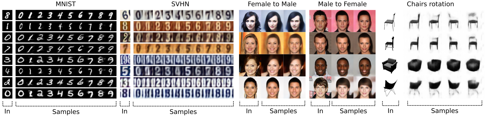

<p align="center">

</p>

This repository contains the official implementation of the paper: 

"Y-Autoencoders: disentangling latent representations via sequential-encoding", Massimiliano Patacchiola, Patrick Fox-Roberts, Edward Rosten. Arxiv 2019. [[download paper]](https://arxiv.org/pdf/1907.10949.pdf)

Please cite this paper if you use the code in this repository as part of a published research project:

```
@article{patacchiola2019yautoencoders,
  title={Y-Autoencoders: disentangling latent representations via sequential-encoding},
  author={Patacchiola, Massimiliano and Fox-Roberts, Patrick and Rosten, Edward},
  journal={arXiv preprint arXiv:1907.10949},
  year={2019}
}
```

This code allows reproducing the quantitative results reported in the paper. In particular the ablation experiment (Section 3.2) and the comparison against baselines experiment (Section 3.3).

Requirements
============

The code has been tested on `Ubuntu 18.04.2 LTS`, with `Python 2.7` , `Tensorflow 1.10` and `Numpy 1.15.1`. In the test phase `OpenCV 3.4.3.18` and `Scikit-image 0.14.2` have been used to manipulate and visualize the samples. We reccommend the use of a virtual environment (e.g. [conda](https://docs.conda.io/en/latest/)) to setup all the packages. Even though training and test have been performend on the GeForce GTX 1060, a GPU is not strictly required, but a decent amount of RAM may be necessary in order to load the model and the dataset. To better visualize this README offline the use of `grip` is suggested:

```
pip install grip
grip ./README.md
```

This will allow to visualize the README offline directly from the browser.

To install Tensorflow GPU version 1.10 run this command from `pip`:
```
pip install https://storage.googleapis.com/tensorflow/linux/gpu/tensorflow_gpu-1.10.0-cp27-none-linux_x86_64.whl
```

Otherwise you can install the CPU version:

```
pip install https://storage.googleapis.com/tensorflow/linux/cpu/tensorflow-1.10.0-cp27-none-linux_x86_64.whl
```

Additional packages can also be installed with `pip`:

```
pip install opencv-python==3.4.3
pip install scikit-image==0.14
```

All the procedures reported below will work only if the current terminal directory is the code folder.
The MNIST dataset is included in the package but it must be unziped, on a Unix machine run the following command:

```
unzip ./datasets/mnist.zip -d ./datasets/
```

This will add the folders `./datasets/mnist/train` and `./datasets/mnist/test` needed for the experiments.

Training
=========

The file `train.py` allows training the architectures with given hyperparameters. By default those are set in agreement with the baseline condition reported in the paper: number of epochs=100, learning rate=0.0001, implicit units=32, lambda explicit=1.0, lambda implicit=1.0. 

Ablation study
--------------
To reproduce the four ablation conditions simply set the parameters `lambda_e` and `lambda_i` in the command line:

**Condition lambda_e=0.0 and lambda_i=0.0**

```
python train.py --arch="yae" --lambda_e=0.0 --lambda_i=0.0
```

**Condition lambda_e=1.0 and lambda_i=0.0**

```
python train.py --arch="yae" --lambda_e=1.0 --lambda_i=0.0
```

**Condition lambda_e=0.0 and lambda_i=1.0**

```
python train.py --arch="yae" --lambda_e=0.0 --lambda_i=1.0
```

**Condition lambda_e=1.0 and lambda_i=1.0**

```
python train.py --arch="yae" --lambda_e=1.0 --lambda_i=1.0
```

Comparison against baselines
------------------------------
The following commands can be used to train the four models:

**Y-AE**

```
python train.py --arch="yae" --lambda_e=1.0 --lambda_i=1.0
```

**Y-AE + ablation**

```
python train.py --arch="yae" --lambda_e=1.0 --lambda_i=0.0
```

**cAE**

```
python train.py --arch="cae"
```

**cAE + regularization**

```
python train.py --arch="cae" --epochs=20 --implicit_units=16 --wdecay=0.0001
```

**adversarial-AE + regularization**

```
python train.py --arch="aae" --epochs=20 --implicit_units=16 --wdecay=0.0001
```

**VAE**

```
python train.py --arch="vae"
```

**beta-VAE**

```
python train.py --arch="vae" --beta=2.0
```

Note that the folders in `./results` are automatically named to separate the different conditions. The logs are saved in the `log` subdir and they can be visualized through tensorboard:

```
tensorboard --logdir="./path/to/log"
```

The networks are saved at the end of the training in the `model` subdir.

LeNet classifiers
------------------

It is possible to train a LeNet classifier through the following command:

```
python train.py --arch="lenet" --epochs=30 --lrate=0.0001 --wdecay=0.0001
```

To increase the variance of the ensemble each network should be trained with different hyperparameters values.


Test
=====

Losses on the test set
-----------------------

It is possible to load a pretrained model in order to measure the losses on the test set.

```
python test.py --arch="cae" --type="loss" --resume="./results/cae_ep10_wdecay0.0001_units16/model/131315_27032019_4679/model.ckpt" --path="./results/cae_ep10_wdecay0.0001_units16"
```

This will show on the terminal the average loss and will save a CVS file in the `test_loss` folder.

Generating artificial data
----------------------------

A pretrained model can be used to generate artificial data from the test set. The model is loaded in memory and the test set iterated element by element. For each input 10 artificial digits are generated, each digit should keep the style of the input but with a different content. 

For instance to generate the data for a regularized cAE you may have to run something like this:

```
python test.py --arch="cae" --implicit_units=16 --type="gendata" --resume="./results/cae_ep10_wdecay0.0001_units16/model/131315_27032019_4679/model.ckpt" --path="./results/cae_ep10_wdecay0.0001_units16"
```

This will create a new folder named `gendata` with numpy features and labels of the artificial dataset. Those can be visualized with matplotlib. The artificial data can also be used for testing the accuracy of an external classifier, in order to verify the quality of the samples.

Metrics
--------

Given the artificial data generated in the previous step it is now possible to measure the internal MSE and SSMI. This can be done through the test type `metrics` that requires the path to the `gendata` folder. The command to run may look like this:

```
python test.py --arch="cae" --implicit_units=16 --type="metrics" --tot_samples=20 --resume="/home/mpatacchiola/Y-autoencoder-paper/code/results/cae_ep10_wdecay0.0001_units16/model/131315_27032019_4679/model.ckpt" --path="./results/cae_ep10_wdecay0.0001_units16" --gendata_path="./results/cae_ep10_wdecay0.0001_units16/gendata/132252_27032019" 
```

This will generate a folder named `samples` with the generated data produced for the first 20 samples in the test set, this value can be changed modifying the parameter `--tot_samples=20`. Moreover, the MSE and SSMI will be both printed on terminal and saved on a CSV file in the `metrics` folder.

Ensemble accuracy
------------------

It is possible to use an external classifier, like a LeNet, to verify if the digit produced in the `gendata` step are recognized. Once the LeNet has been trained (see `Training` section) it is possible to load the model and get the accuracy metric. The command will be similar to this one:

```
python test.py --arch="lenet" --type="accuracy" --batch=30000 --resume="./results/lenet_ep30_wdecay0.0001_lr0.0001/model/140744_28032019_14039/model.ckpt" --path="./results/cae_ep10_wdecay0.0001_units16" --gendata_path="./results/cae_ep10_wdecay0.0001_units16/gendata/132252_27032019" 
```

The command will print the loss and accuracy on this dataset. Moreover, a CSV file will be stored in the subdir `test_gendata_accuracy` in the `--path` folder.
The parameter `batch` define how many random samples to take from the gendata dataset, depending on your machine you can increase or decrease this value (the maximum size of the artificial dataset is 100000 features).


License
=========

MIT License

Copyright (c) 2019 Massimiliano Patacchiola, Patrick Fox-Roberts, Edward Rosten

Permission is hereby granted, free of charge, to any person obtaining a copy of this software and associated documentation files (the "Software"), to deal in the Software without restriction, including without limitation the rights to use, copy, modify, merge, publish, distribute, sublicense, and/or sell copies of the Software, and to permit persons to whom the Software is furnished to do so, subject to the following conditions:

The above copyright notice and this permission notice shall be included in all copies or substantial portions of the Software.

THE SOFTWARE IS PROVIDED "AS IS", WITHOUT WARRANTY OF ANY KIND, EXPRESS OR IMPLIED, INCLUDING BUT NOT LIMITED TO THE WARRANTIES OF MERCHANTABILITY, FITNESS FOR A PARTICULAR PURPOSE AND NONINFRINGEMENT. IN NO EVENT SHALL THE AUTHORS OR COPYRIGHT HOLDERS BE LIABLE FOR ANY CLAIM, DAMAGES OR OTHER LIABILITY, WHETHER IN AN ACTION OF CONTRACT, TORT OR OTHERWISE, ARISING FROM, OUT OF OR IN CONNECTION WITH THE SOFTWARE OR THE USE OR OTHER DEALINGS IN THE SOFTWARE.
